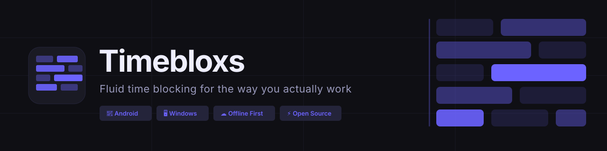
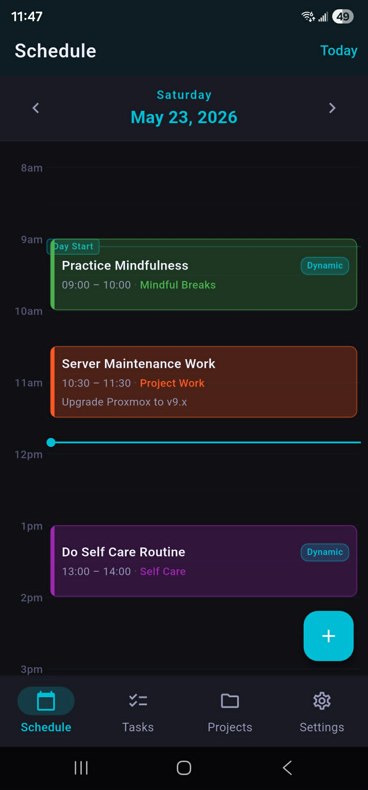
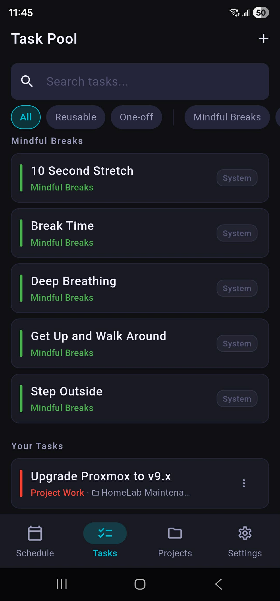
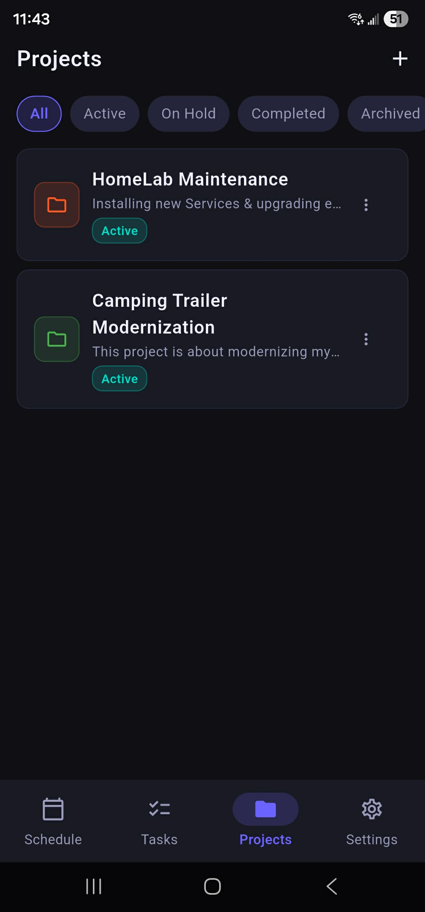
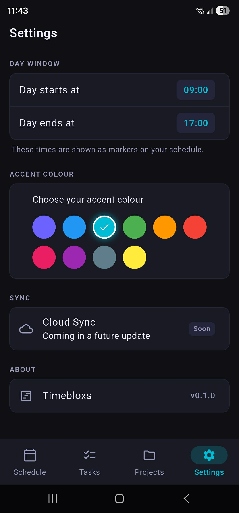

# 

Timebloxs is an offline-first time blocking app for Android and Windows. Plan your day with fluid, dynamic time blocks — schedule specific tasks or leave placeholder blocks to fill in the morning of. Built for people who want structure without rigidity.

---

## Screenshots

<p align="center">
  
  &nbsp;&nbsp;
  
  &nbsp;&nbsp;
  
  &nbsp;&nbsp;
  
</p>

---

## Features

**Schedule**
- Full 24-hour timeline day view
- Static blocks for specific known tasks
- Dynamic blocks — reserve time, decide the task later
- Assign, reassign, or unassign tasks to dynamic blocks
- Start, complete, or skip blocks as your day progresses
- Day Start and Day End markers based on your preferences
- Navigate between days with a date picker

**Task Pool**
- Reusable tasks that stay in your pool permanently
- One-off tasks that can be archived when done
- System mindful break tasks (Break Time, Stretch, Walk, etc.)
- Filter by category, project, or search
- Sub-tasks for breaking down project work

**Projects**
- Group tasks under projects
- Track project status — Active, On Hold, Completed, Archived
- Project colour displayed on schedule blocks
- Safe deletion — move tasks to general pool or delete with project

**Settings**
- Customisable accent colour — 10 options
- Day window — set your preferred day start and end times
- Cloud sync coming in v2

---

## Philosophy

Most productivity apps are rigid — a task maps to a time slot, recurring means the same time every day. Timebloxs works differently:

- **Your task pool is separate from your schedule.** Build a library of tasks, then decide what fills each block on the day.
- **Offline first, always.** Your data lives on your device. No account required, no internet needed.
- **Fluid recurring.** Schedule "Take a Break" three times today at different lengths. No rules.
- **Sync is optional.** Cloud sync (coming in v2) is a feature you enable, not a requirement.

---

## Installation

### Android
1. Download the latest `timebloxs-vX.X.X.apk` from the [Releases](https://github.com/juliejohnson2896/TimeBloxs/releases) page
2. On your Android device, enable **Install from unknown sources** in Settings → Security
3. Open the downloaded APK and install

### Windows
1. Download the latest `timebloxs-windows-vX.X.X.zip` from the [Releases](https://github.com/juliejohnson2896/TimeBloxs/releases) page
2. Extract the zip to a folder of your choice
3. Run `timebloxs.exe`

---

## Building from Source

### Prerequisites
- [Flutter](https://flutter.dev/docs/get-started/install) SDK (stable channel)
- Android SDK (for Android builds)
- Visual Studio Build Tools 2022 (for Windows builds)

### Steps

```bash
# Clone the repository
git clone https://github.com/juliejohnson2896/TimeBloxs.git
cd TimeBloxs

# Install dependencies
flutter pub get

# Run code generation
dart run build_runner build --delete-conflicting-outputs

# Run on Android
flutter run -d android

# Run on Windows
flutter run -d windows

# Build release APK
flutter build apk --release

# Build release Windows
flutter build windows --release
```

---

## Self-Hosting Sync (v2)

Timebloxs v2 will support optional cloud sync via a self-hosted [PocketBase](https://pocketbase.io) instance. You will be able to point the app at your own server URL. Full setup instructions will be included in the v2 release.

---

## Roadmap

### v1.0 (Current)
- [x] Offline-first local database
- [x] 24-hour timeline schedule view
- [x] Static and dynamic time blocks
- [x] Task pool with categories
- [x] Project management
- [x] Sub-tasks
- [x] Accent colour customisation
- [x] Android and Windows builds
- [x] GitHub Actions release pipeline

### v2.0 (Planned)
- [ ] Optional cloud sync via self-hosted PocketBase
- [ ] Custom backend URL — point to your own instance
- [ ] Multi-user household support
- [ ] Week and month schedule views
- [ ] Windows installer (MSIX)
- [ ] Google Play Store release
- [ ] In-app updater
- [ ] Kanban board for projects
- [ ] Database migration tooling for self-hosters

---

## Tech Stack

| Layer | Technology |
|---|---|
| Framework | Flutter (Dart) |
| Local database | Drift (SQLite) |
| State management | Riverpod |
| Navigation | go_router |
| Sync backend | PocketBase (v2) |
| Build pipeline | GitHub Actions |

---

## Contributing

Timebloxs is open source and contributions are welcome. Please open an issue before submitting a pull request so we can discuss the change.

1. Fork the repository
2. Create a feature branch (`git checkout -b feature/your-feature`)
3. Commit your changes (`git commit -m 'feat: add your feature'`)
4. Push to the branch (`git push origin feature/your-feature`)
5. Open a Pull Request

---

## License

MIT License — see [LICENSE](LICENSE) for details.

---

<p align="center">
  Built with Flutter &nbsp;·&nbsp; Designed for humans &nbsp;·&nbsp; Owned by you
</p>
